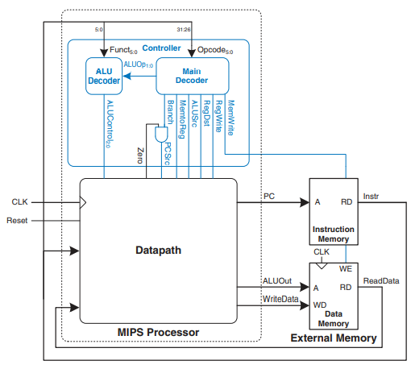

# MIPS Single-Cycle CPU in Verilog

from [Harris & Harris _Digital Design and Computer Architecture_, 2nd Edition](https://booksite.elsevier.com/9780123944245/?ISBN=9780123944245)

## MIPS single-cycle processor interfaced to external memory

